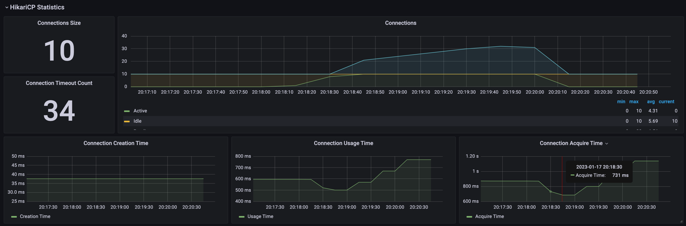

# Нагрузочное тестирование

## Подготовка к тестированию

Запускаем локальный кластер k8s в docker (папка [`k8s`](k8s)):

```shell
$ kind create cluster --config kind.yml
$ kubectl apply -f https://raw.githubusercontent.com/kubernetes/ingress-nginx/main/deploy/static/provider/kind/deploy.yaml
```

Загружаем docker images в кластер `kind` (папка [`scripts`](scripts)):

```shell
$ ./scripts/load-images.sh
```

Загружаем репозитории:

```shell
$ helm repo add romanow https://romanow.github.io/helm-charts/
$ helm repo add deliveryhero https://charts.deliveryhero.io/
$ helm repo add prometheus-community https://prometheus-community.github.io/helm-charts
$ helm repo update
```

Устанавливаем инструменты для мониторинга кластера:

```shell
$ helm install kube-state-metrics prometheus-community/kube-state-metrics --set image.tag=v2.6.0 

$ helm install prometheus -f prometheus/values.yaml romanow/prometheus

$ helm install influxdb -f influxdb/values.yaml romanow/influxdb

$ helm install grafana -f grafana/values.yaml romanow/grafana
```

Устанавливаем Camunda State Machine:

```shell
$ helm install postgres -f postgres/values.yaml romanow/postgres

$ helm install camunda-state-machine -f camunda/values.yaml romanow/java-service

$ kubectl create configmap services-stubs-mappings --from-file=../stubs/mappings
$ kubectl create configmap services-stubs-files --from-file=../stubs/__files
$ helm install wiremock -f wiremock/values.yaml deliveryhero/wiremock
```

Запускаем end-to-end тесты (папка [`tests/postman`](tests/postman)):

```shell
$ newman run -e kind-environment.json collection.json
```

Запускаем нагрузочное тестирование (папка [`tests/load`](tests/load)):

```shell
$ brew install k6
$ k6 run \
    --out influxdb=http://localhost:32086/k6 \
    -e HOSTNAME=localhost:32080 \
    k6-load.js
```

## Тестовый сценарий

* Создание расчета, инициализация процесса в camunda и запуск ETL.
* Отправка события об окончании ETL процесса, запуск расчета.
* Отправка события об окончании расчета и запуск обратного ETL.
* Отправка события об окончании обратного ETL и завершения расчета.

Задержка на мокируемых сервисах 200мс.

## Ресурсы приложения

* Конфигурация кластера k8s: локальный кластер kind, 6CPU, 12Gb RAM, 2 swap.
* Postgres: 1 CPU, 1Gb RAM, настройки корректно сконфигурированы в соответствии с
  рекомендациями ([PGTune](https://pgtune.leopard.in.ua/)).
* Camunda State Machine: 2 CPU, 4Gb RAM.

## Нагрузочное тестирование

##### Без нагрузки


#### Маленькая нагрузка

* 20s –> 10 vu;
* 60s –> 20 vu;
* 10s –> 10 vu;


В логах появляются
ошибки: `SQLTransientConnectionException: HikariPool-1 - Connection is not available, request timed out after 30003ms.`.



Причина: маленький connection pool на HikariCP, видимо Camunda долго держит соединение. Увеличиваем до 40 (в postgres
`max_connections = 100`).

#### Маленькая нагрузка с новыми параметрами Connection Pool

Ошибок в логах больше нет, connection pool ведет себя корректно.


Но увеличилось среднее время выполнения запроса.


Max, 95%, 90% легли рядом, больших задержек нет.


#### Большая нагрузка

* 20s –> 10 vu;
* 20s –> 20 vu;
* 60s –> 50 vu;
* 10s –> 20 vu;


#### Масштабируем сервис Camunda State Machine до 2х pods

Чтобы второй instance поместился в кластер, уменьшаем ресурсы 1CPU, 3Gb RAM.


